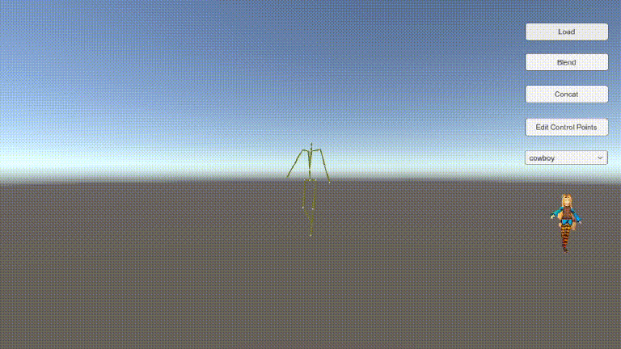
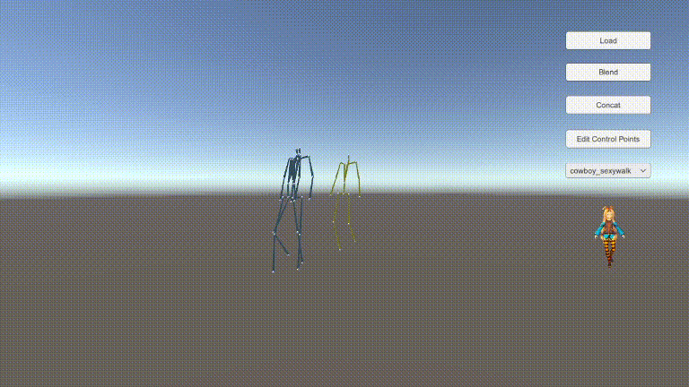
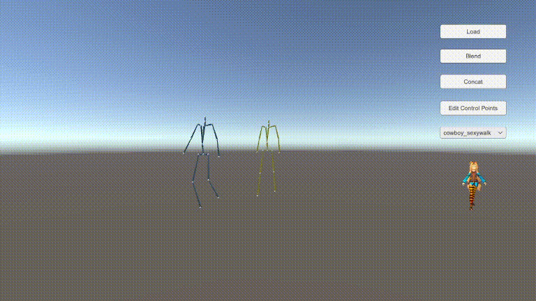
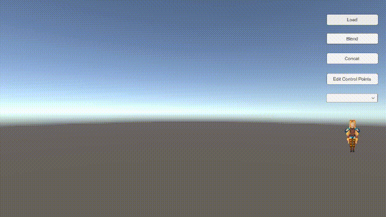
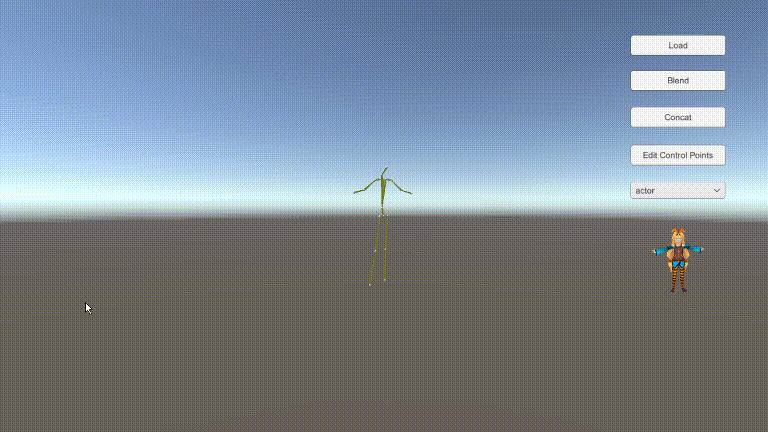

# Motion Path Editing

## 介紹

* 載入多個 BVH 檔
* 編輯 BVH 的路徑
* 合併兩個動作
  
* 將兩個動作連接
  
* 相機選擇跟隨的動作
* 為骨架套上模型

## 使用教學

### 載入 BVH 檔

點擊 `Load` 按鈕，並且選擇要載入的 bvh

> 注意：這邊只接受 18 個關節格式

### 合併兩個動作

載入兩個 BVH 檔後，再點擊 `Blend` 按鈕，並且選擇要載入的 BVH

### 連接兩個動作

載入兩個 BVH 檔後，再點擊 `Concat` 按鈕，並且選擇要載入的 BVH

### 編輯動作路徑

選擇要編輯的動作後，點擊 `Edit Control Points`，接著透過拖移控制點來做編輯

### 切換相機跟隨對象

在下拉選單中，選擇要跟隨的動作

